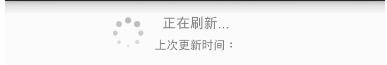
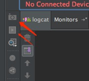
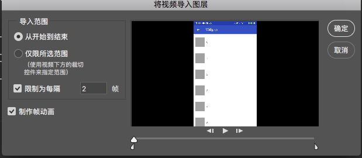

## RecyclerView刷新控件及CoordinatorLayout合用实现

> 原本是想将XRecyclerView引入项目，但是我只想加入轻便简单一点的刷新控件，于是在XRecyclerView的基础上做了个简化版的控件，并用上伸缩布局。
完整代码在我的gitHub上：[Widgets](https://github.com/cherishyan/Widgets) ，另末尾附上如何使用Android Studio对手机截屏或者录制视频，并制作Gif。

效果：


#### 何种样式

我们首先从整体出发考虑应该实现怎样的布局。我的界面应该是**伸缩布局加上RecyclerView** ,细分一点：
CoordinatorLayout ：AppBar -> CollapsingToolbarLayout。
RecyclerView： RefreshHeader布局和LoadMoreFooter布局、Indicator动画、IRecyclerView的TouchEvent处理等。

CoordinatorLayout即可伸展的图片和Appbar：

```
    <android.support.design.widget.CoordinatorLayout xmlns:android="http://schemas.android.com/apk/res/android"
    xmlns:app="http://schemas.android.com/apk/res-auto"
    android:layout_width="match_parent"
    android:layout_height="match_parent"
    android:fitsSystemWindows="true">

    <android.support.design.widget.AppBarLayout
        android:id="@+id/appbar"
        android:layout_width="match_parent"
        android:layout_height="wrap_content"
        android:fitsSystemWindows="true"
        app:theme="@style/ThemeOverlay.AppCompat.Dark.ActionBar">

        <android.support.design.widget.CollapsingToolbarLayout
            android:layout_width="match_parent"
            android:layout_height="match_parent"
            android:fitsSystemWindows="true"
            app:contentScrim="?attr/colorPrimary"
            app:layout_scrollFlags="scroll|exitUntilCollapsed"
            app:expandedTitleMarginStart="48dp"
            app:expandedTitleMarginEnd="64dp">

            <ImageView
                android:id="@+id/backdrop"
                android:layout_width="match_parent"
                android:layout_height="match_parent"
                android:scaleType="centerCrop"
                android:fitsSystemWindows="true"
                android:src="@mipmap/welcome_img"
                app:layout_collapseMode="parallax" />

            <android.support.v7.widget.Toolbar
                android:id="@+id/toolbar"
                android:layout_width="match_parent"
                android:layout_height="?attr/actionBarSize"
                app:popupTheme="@style/ThemeOverlay.AppCompat.Light"
                app:layout_collapseMode="pin" />


        </android.support.design.widget.CollapsingToolbarLayout>

    </android.support.design.widget.AppBarLayout>
```

#### 何种Indicator



indicator即有8个小圆环绕成一个大圆，颜色和大小不停变化的图形，绘制过程：

* 首先确定8个小圆的位置

要环绕在一个大圆上，那么每个小圆的坐标应该是在圆周上的。圆O的圆心为(a,b),半径为R,点A与到X轴的为角α，则点A的坐标为(a+R*cosα,b+R*sinα)。

* 以上坐标计算出来以后(Point)，canvas.drawCircle()画出：

```java
    Point circleAt(int width, int height, float radius, double angle) {
        float x = (float) (width / 2 + radius * (Math.cos(angle)));
        float y = (float) (height / 2 + radius * (Math.sin(angle)));
        return new Point(x, y);
    }
```

```java
 public void draw(Canvas canvas, Paint paint) {
        float radius=getWidth()/10;
        for (int i = 0; i < 8; i++) {
            canvas.save();
            Point point=circleAt(getWidth(),getHeight(),getWidth()/2-radius,i*(Math.PI/4));
            canvas.translate(point.x,point.y);
            canvas.scale(scaleFloats[i],scaleFloats[i]);
            paint.setAlpha(alphas[i]);
            canvas.drawCircle(0,0,radius,paint);
            canvas.restore();
        }
 }
```
 
 其中`alphas[]`和`scaleFloats[]`分别为色值和缩放比。
 
 * 旋转动画
 
 对于色值和大小的变化我们使用ValueAnimator，针对每一个Point做不同延时的动画就可以了：
 
 ```java
 public List<Animator> createAnimation() {
         List<Animator> animators=new ArrayList<>();
         int[] delays= {0, 120, 240, 360, 480, 600, 720, 780, 840};
         for (int i = 0; i < 8; i++) {
             final int index=i;
             ValueAnimator scaleAnim=ValueAnimator.ofFloat(1,0.4f,1);
             scaleAnim.setDuration(1000);
             scaleAnim.setRepeatCount(-1);
             scaleAnim.setStartDelay(delays[i]);
             scaleAnim.addUpdateListener(new ValueAnimator.AnimatorUpdateListener() {
                 @Override
                 public void onAnimationUpdate(ValueAnimator animation) {
                     scaleFloats[index] = (float) animation.getAnimatedValue();
                     postInvalidate();
                 }
             });
             scaleAnim.start();
 
             ValueAnimator alphaAnim=ValueAnimator.ofInt(255, 77, 255);
             alphaAnim.setDuration(1000);
             alphaAnim.setRepeatCount(-1);
             alphaAnim.setStartDelay(delays[i]);
             alphaAnim.addUpdateListener(new ValueAnimator.AnimatorUpdateListener() {
                 @Override
                 public void onAnimationUpdate(ValueAnimator animation) {
                     alphas[index] = (int) animation.getAnimatedValue();
                     postInvalidate();
                 }
             });
             alphaAnim.start();
             animators.add(scaleAnim);
             animators.add(alphaAnim);
         }
         return animators;
 }
 ```

* 主要的Indicator步骤已经完成，其他细节可以查看代码。

#### 何种header

header这个继承LinearLayout的View主要作用是对刷新状态做出处理，一共是4种刷新态：normal,release_to_refresh,refreshing,done。
下拉箭头跟随着刷新态做出动画效果：

```java
  //箭头翻转动画
        mRotateUpAnim = new RotateAnimation(0.0f, -180.0f,
                Animation.RELATIVE_TO_SELF, 0.5f, Animation.RELATIVE_TO_SELF, 0.5f);
        mRotateUpAnim.setDuration(ROTATE_ANIM_DURATION);
        mRotateUpAnim.setFillAfter(true);
        mRotateDownAnim = new RotateAnimation(-180.0f, 0.0f,
                Animation.RELATIVE_TO_SELF, 0.5f, Animation.RELATIVE_TO_SELF, 0.5f);
        mRotateDownAnim.setDuration(ROTATE_ANIM_DURATION);
        mRotateDownAnim.setFillAfter(true);
```

状态改变：

```java
 public void changeState(int state){
        //状态和上一次相同，不用改变.
        if(state == mState)
            return ;
        if(state == STATE_NORMAL){
            mArrowImageView.setVisibility(View.VISIBLE);
            mProgressBar.setVisibility(View.INVISIBLE);
        }else if(state == STATE_REFRESHING){
            mArrowImageView.setVisibility(View.INVISIBLE);
            mProgressBar.setVisibility(View.VISIBLE);
            mArrowImageView.clearAnimation();
            smoothScrollTo(mMeasuredHeight);
        }else if(state == STATE_RELEASE_TO_REFRESH){
            mProgressBar.setVisibility(View.INVISIBLE);
            mArrowImageView.setVisibility(View.VISIBLE);
        }else if(state == STATE_DONE){
            mArrowImageView.setVisibility(View.INVISIBLE);
            mProgressBar.setVisibility(View.INVISIBLE);
        }


        switch(state){
            case STATE_NORMAL:
                if (mState == STATE_RELEASE_TO_REFRESH) {
                    mArrowImageView.startAnimation(mRotateDownAnim);
                }
                if (mState == STATE_REFRESHING) {
                    mArrowImageView.clearAnimation();
                }
                mStatusTextView.setText(R.string.listview_header_hint_normal);
                break;
            case STATE_RELEASE_TO_REFRESH:
                if (mState != STATE_RELEASE_TO_REFRESH) {
                    mArrowImageView.clearAnimation();
                    mArrowImageView.startAnimation(mRotateUpAnim);
                    mStatusTextView.setText(R.string.listview_header_hint_release);
                }
                break;
            case     STATE_REFRESHING:
                mStatusTextView.setText(R.string.refreshing);
                break;
            case    STATE_DONE:
                mStatusTextView.setText(R.string.refresh_done);
                break;
            default:
                break;
        }
        mState = state; //记录本次状态
    }
```

* 滑动过程的距离应该是需要关注的，我们记录了headerView的原始高度mMeasuredHeight,在TouchEvent传入的位移值做判断，这里传入的位移值不是实际滑动的值，
而是做了一定倍率的压缩的`deltaY / rate`。这样可以保证下拉出来不会留出过多的空白。

```java
 /**
     * 滑动过程中的状态变化
     * @param delta 相对滑动距离
     */
    public void onMove(float delta){
        if(getVisibleHeight() > 0 || delta > 0) {
            setVisibleHeight((int) delta + getVisibleHeight());
            if (mState <= STATE_RELEASE_TO_REFRESH) {
                if (getVisibleHeight() > mMeasuredHeight) { //滑动高度大于固定高度，准备刷新
                    changeState(STATE_RELEASE_TO_REFRESH);
                }else {
                    changeState(STATE_NORMAL);
                }
            }
        }
    }
```

* Footer的实现和header没有很大区别。

#### 何种RecyclerView

RecyclerView考虑几个问题:一个是自定义的头和尾的itemType保留字是否会和业务Adapter定义的header冲突；然后是处理CoordinatorLayout的滑动冲突；
多个header头部设置在RecyclerVeiew中(XRecyclerView)：

```java
        @Override
        public int getItemViewType(int position) {
            int adjPosition = position - (getHeadersCount() + 1);
            if (isRefreshHeader(position)) {
                return TYPE_REFRESH_HEADER;
            }
            if (isHeader(position)) {
                position = position - 1;
                return sHeaderTypes.get(position);
            }
            if (isFooter(position)) {
                return TYPE_FOOTER;
            }
            int adapterCount;
            if (mAdapter != null) {
                adapterCount = mAdapter.getItemCount();
                if (adjPosition < adapterCount) {
                    int type =  mAdapter.getItemViewType(adjPosition);
                    if(isReservedItemViewType(type)) {
                        throw new IllegalStateException("IRecyclerView require itemViewType in adapter should be less than 10000 " );
                    }
                    return type;
                }
            }
            return 0;
        }
```

RecyclerView中的Adapter设置多个头(用viewType判断)：

```java
  @Override
        public ViewHolder onCreateViewHolder(ViewGroup parent, int viewType) {
            if (viewType == TYPE_REFRESH_HEADER) {
                return new SimpleViewHolder(mRefreshHeader);
            } else if (isHeaderType(viewType)) {
                return new SimpleViewHolder(getHeaderViewByType(viewType));
            } else if (viewType == TYPE_FOOTER) {
                return new SimpleViewHolder(mFooter);
            }
            // 一般的holder
            return mAdapter.onCreateViewHolder(parent, viewType);
        }
```

#### android studio 录屏制作GIf



* 连上手机以后，两个按钮可见，上一个是手机截屏，下一个是录屏。

* 录屏完成后保存格式是mp4，然后打开ps(ps cc 2017)

* 文件->导入->视频帧到图层



限制每隔2帧或更低会让gif原始大小小一点。

* 如果不用做裁剪删除某些帧的操作，直接文件->导出->存储为Web所用格式(旧版)。

* 如果Gif太大，修改弹出窗里面的颜色，百分比等参数可适当压缩。
