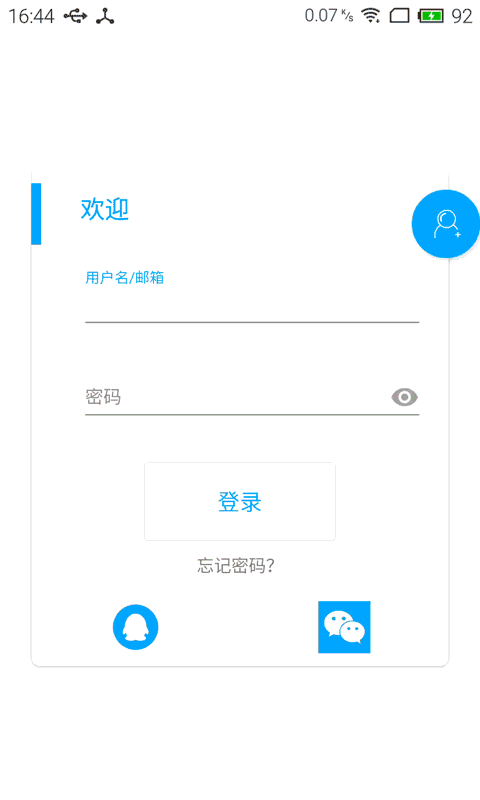

## Material 登录注册界面效果

> 在网上看见一个不错的登录注册效果，尝试着写了一遍，主要使用TextInputLayout做输入框，FloatingActionButton做页面切换按钮。
 遵循Material design色彩样式。源码在我的Github [Widget](https://github.com/cherishyan/Widgets)中，并长期更新一些有意思的小组件或功能。
 新年开工大吉 ！
  

##### 效果

 

##### 实现

* 登录界面布局

```
<?xml version="1.0" encoding="utf-8"?>
<RelativeLayout xmlns:android="http://schemas.android.com/apk/res/android"
    xmlns:app="http://schemas.android.com/apk/res-auto"
    xmlns:tools="http://schemas.android.com/tools"
    android:layout_width="match_parent"
    android:layout_height="match_parent"
    >

    <android.support.v7.widget.CardView
        android:id="@+id/cardview"
        android:layout_width="350dp"
        android:layout_height="420dp"
        android:layout_centerInParent="true"
        app:cardCornerRadius="7dp"
        app:cardUseCompatPadding="true">

        <LinearLayout
            android:layout_width="match_parent"
            android:layout_height="match_parent"
            android:orientation="vertical">

            <RelativeLayout
                android:layout_width="wrap_content"
                android:layout_height="wrap_content">

                <View
                    android:layout_width="8dp"
                    android:layout_height="50dp"
                    android:layout_marginTop="15dp"
                    android:background="#039be5" />

                <TextView
                    android:layout_width="wrap_content"
                    android:layout_height="50dp"
                    android:layout_alignParentStart="true"
                    android:layout_marginLeft="40dp"
                    android:layout_marginTop="10dp"
                    android:gravity="center"
                    android:text="@string/login"
                    android:textColor="#03a9f4"
                    android:textSize="20sp"
                    android:textStyle="bold"/>
            </RelativeLayout>

            <LinearLayout
                android:layout_width="match_parent"
                android:layout_height="wrap_content"
                android:layout_marginLeft="40dp"
                android:layout_marginRight="20dp"
                android:layout_marginTop="20dp">

                <android.support.design.widget.TextInputLayout
                    android:layout_width="match_parent"
                    android:layout_height="match_parent">

                    <EditText
                        android:id="@+id/login_edname"
                        android:layout_width="match_parent"
                        android:layout_height="match_parent"
                        android:gravity="center_vertical"
                        android:hint="@string/login_edaccount"
                        android:paddingLeft="10dp"
                        android:textColorHint="#9e9e9e"
                        android:textSize="15sp" />
                </android.support.design.widget.TextInputLayout>
            </LinearLayout>

            <LinearLayout
                android:layout_width="match_parent"
                android:layout_height="wrap_content"
                android:layout_marginLeft="40dp"
                android:layout_marginRight="20dp"
                android:layout_marginTop="20dp">

                <android.support.design.widget.TextInputLayout
                    android:layout_width="match_parent"
                    android:layout_height="match_parent">

                    <EditText
                        android:id="@+id/login_edpwd"
                        android:layout_width="match_parent"
                        android:layout_height="match_parent"
                        android:gravity="center_vertical"
                        android:hint="@string/login_edpwd"
                        android:paddingLeft="10dp"
                        android:textColorHint="#9e9e9e"
                        android:inputType="textPassword"
                        android:textSize="15sp" />
                </android.support.design.widget.TextInputLayout>
            </LinearLayout>

            <RelativeLayout
                android:layout_width="match_parent"
                android:layout_height="wrap_content"
                android:layout_gravity="center_horizontal"
                android:layout_marginTop="30dp">

                <Button
                    android:id="@+id/login_btn"
                    android:layout_width="wrap_content"
                    android:layout_height="wrap_content"
                    android:layout_centerInParent="true"
                    android:background="@drawable/btn_shape"
                    android:paddingBottom="20dp"
                    android:paddingLeft="60dp"
                    android:paddingRight="60dp"
                    android:paddingTop="20dp"
                    android:text="@string/login_btnok"
                    android:textColor="#03a9f4"
                    android:textSize="18sp" />
            </RelativeLayout>

            <LinearLayout
                android:layout_width="match_parent"
                android:layout_height="wrap_content"
                android:layout_marginTop="10dp"
                android:gravity="center_horizontal">

                <TextView
                    android:id="@+id/login_tvfogot"
                    android:layout_width="wrap_content"
                    android:layout_height="wrap_content"
                    android:text="@string/login_fogotpwd" />
            </LinearLayout>

            <LinearLayout
                android:layout_width="match_parent"
                android:layout_height="wrap_content"
                android:layout_marginTop="20dp"
                android:gravity="center_horizontal">

                <ImageView
                    android:id="@+id/login_qq"
                    android:layout_width="0dp"
                    android:layout_height="wrap_content"
                    android:layout_weight="1"
                    android:src="@mipmap/qq" />

                <ImageView
                    android:id="@+id/login_wechat"
                    android:layout_width="0dp"
                    android:layout_height="wrap_content"
                    android:layout_weight="1"
                    android:src="@mipmap/wechat" />
            </LinearLayout>
        </LinearLayout>

    </android.support.v7.widget.CardView>

    <android.support.design.widget.FloatingActionButton
        android:id="@+id/fab"
        android:layout_width="wrap_content"
        android:layout_height="wrap_content"
        android:layout_alignParentEnd="true"
        android:layout_alignTop="@+id/cardview"
        android:layout_marginTop="25dp"
        android:src="@mipmap/register"
        android:transitionName="login"
        app:fabSize="normal" />

</RelativeLayout>

```

利用CardView居中登录框，登录卡片略小于注册卡片，这样能体现一点层次效果。FloatingActionButton继承自ImageButton，我们使用它主要是为了做出切换效果。
如果要修改FloatingActionButton的背景色，要使用FloatingActionButton的自定义属性`app:backgroundTint="#03a9f4"`，使用Android的background是没有作用的。

* 切换效果

登录切换到注册，这是两个界面。一般startActivity跳转会有默认的**过渡动画**，首先我们要在点击FloatingActionButton事件中取消掉默认的过渡动画：

```java
    public void onClick(View v) {
        switch (v.getId()){
            case R.id.fab:
                getWindow().setEnterTransition(null);
                getWindow().setExitTransition(null);
                if(Build.VERSION.SDK_INT >= Build.VERSION_CODES.LOLLIPOP){
                    ActivityOptions options = ActivityOptions.makeSceneTransitionAnimation(this,fab,fab.getTransitionName());
                    startActivity(new Intent(LoginActivity.this,RegisterActivity.class),options.toBundle());
                }else{
                    startActivity(new Intent(LoginActivity.this,RegisterActivity.class));
                }
                break;
        }
    }
```

要注意的是需要判断一下当前的系统版本是不是高于21，不然我们自己定义的过渡效果可能是无效的。
如果系统版本高于21，因为我们的过渡动画是涉及到两个布局的，我们就需要在View上使用[**Transition框架**](http://www.tuicool.com/articles/zAZNVn)。
我们在登录和注册布局中都给button添加了一个`android:transitionName="login"`，这样我们根据相同的transitionname做出连贯的过渡动画。

取消默认的切换动画，就这两行代码：`getWindow().setEnterTransition(null);`，`getWindow().setExitTransition(null);`

我们拆分一下过渡动画：
1. 按钮FloatingActionButton从右侧滑行到顶部中间
2. 布局首先是隐藏的，在按钮动画过渡完成以后，从按钮处扩散至完整。

按钮FloatingActionButton动画:

```
<transitionSet xmlns:android="http://schemas.android.com/apk/res/android"
    xmlns:tools="http://schemas.android.com/tools"
    android:interpolator="@android:interpolator/linear_out_slow_in"
    android:duration="300">
    <changeBounds>
        <arcMotion
            android:maximumAngle="0"
            android:minimumHorizontalAngle="90"
            android:minimumVerticalAngle="60"/>
    </changeBounds>
</transitionSet>
```

布局显示动画：

```java
    Animator animator = ViewAnimationUtils.createCircularReveal(cv, cv.getWidth() / 2, 0, fab.getWidth() / 2, cv.getHeight());
    animator.setInterpolator(new AccelerateInterpolator());
    animator.setDuration(500);
```

我们看一下`createCircularReveal(View view,int centerX,  int centerY, float startRadius, float endRadius)`
参数比较明显，中心点在顶部中间，即cardView的宽度/2,高度为0，起始和结束半径为button的一半(因为button出去了一部分)和整个cardView的高度
在动画开始时，就开始显示注册布局，所以我们需要一个动画监听：

```java
    animator.addListener(new AnimatorListenerAdapter() {
            @Override
            public void onAnimationStart(Animator animation) {
                cv.setVisibility(View.VISIBLE);
                super.onAnimationStart(animation);
            }

            @Override
            public void onAnimationEnd(Animator animation) {
                super.onAnimationEnd(animation);
            }
        });
    animator.start();
```

至此，主要步骤便实现完成了。